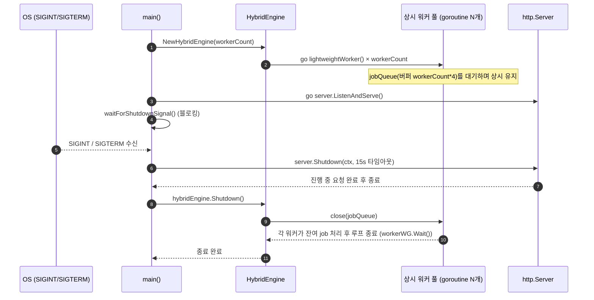
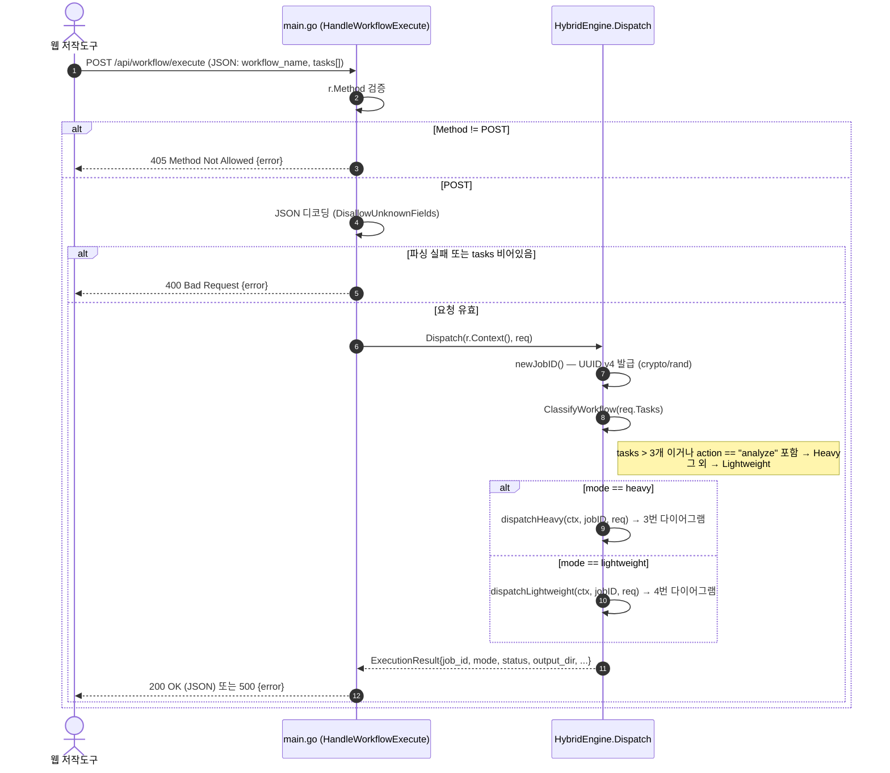
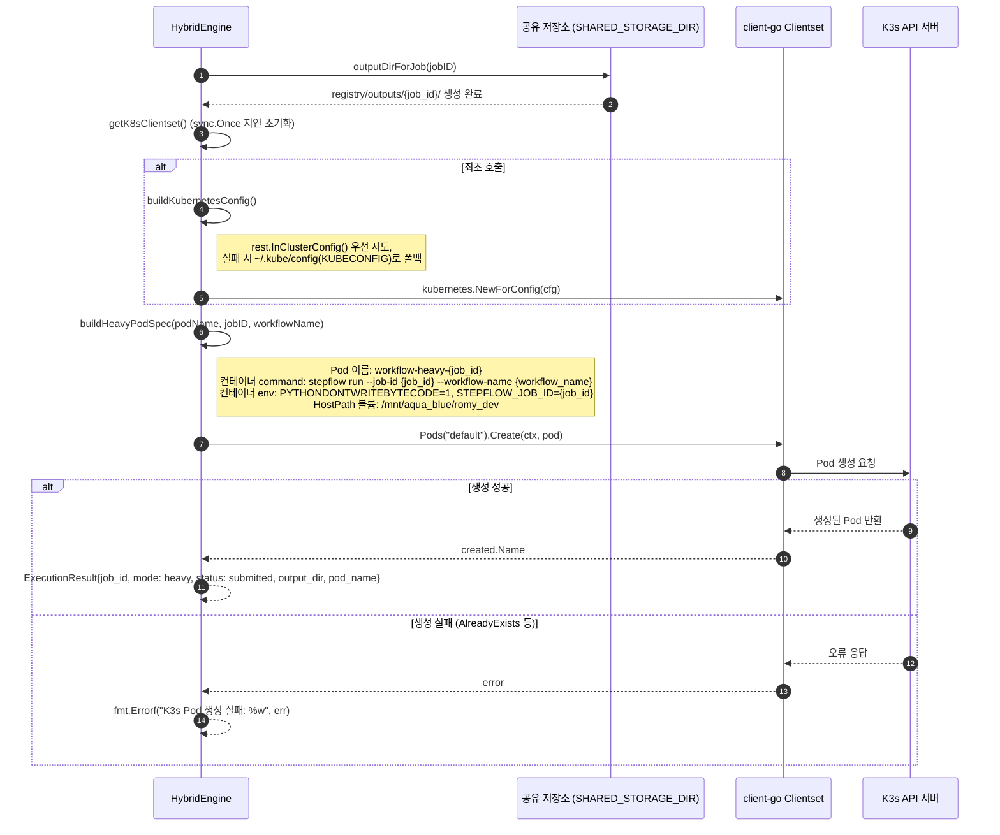
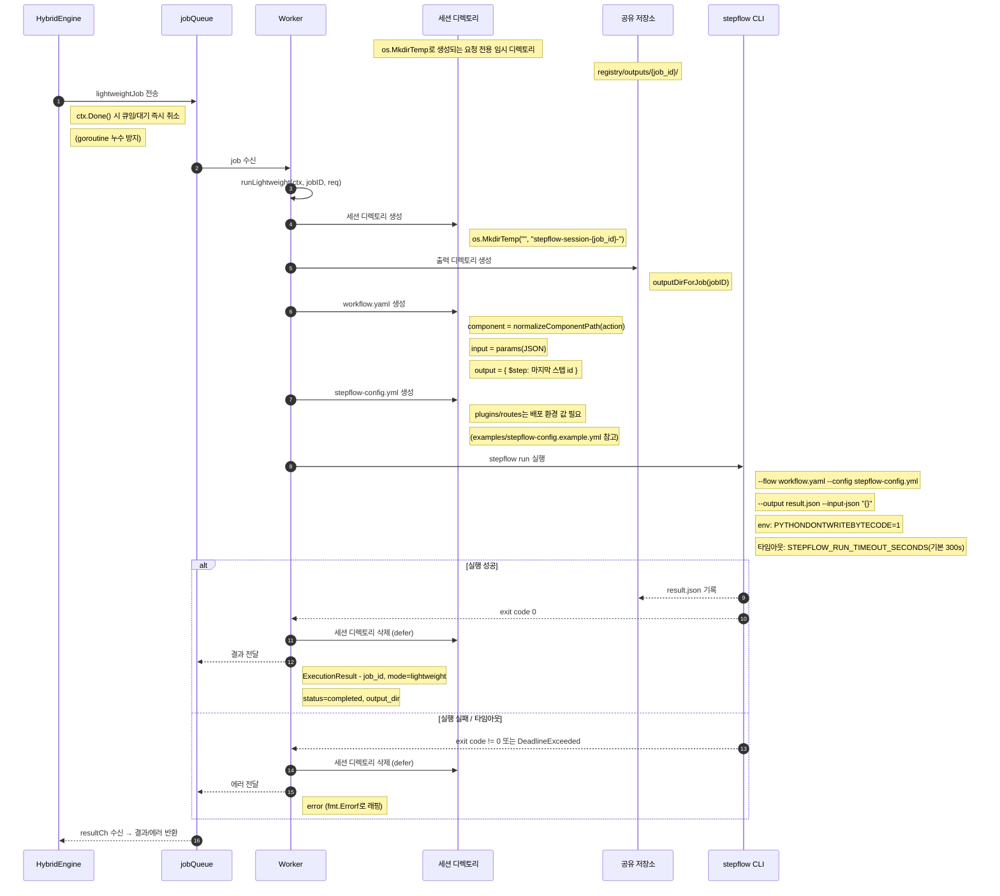

# Stepflow Hybrid Engine — 시퀀스 다이어그램

이 문서는 `main.go`(REST API 라우팅)와 `engine/hybrid.go`(하이브리드 분류·워커 풀·K3s 디스패처)의
전체 실행 흐름을 시퀀스 다이어그램으로 정리한 것이다. CLAUDE.md에 정의된 동시성 안전 규칙과
하이브리드 아키텍처 규칙(Lightweight/Heavy 분기)이 코드상 어떤 순서로 실행되는지 참고하는 용도로 사용한다.

## 1. 서버 시작 및 종료 (Graceful Shutdown)

`main()`이 상시 워커 풀을 기동하고, 종료 시그널 수신 시 HTTP 서버와 워커 풀을 순서대로 정리하는 흐름이다.

## 2. 요청 접수 → 하이브리드 분류 (공통 흐름)

모든 요청은 아래 공통 경로를 거친 뒤 Lightweight/Heavy로 분기한다. 이후 두 분기의 상세 흐름은
3번, 4번 다이어그램을 참고한다.

## 3. Heavy 모드 — K3s Pod-per-workflow

TaskNode 4개 이상이거나 action에 `analyze`가 포함된 경우, `client-go`로 K3s에 전용 Pod를 생성한다.

## 4. Lightweight 모드 — 상시 워커 풀 + `os/exec`

TaskNode 3개 이하이며 action에 `analyze`가 없는 경우, 상시 워커 풀 큐에 작업을 넣고 로컬에서
`stepflow run`을 실행한다.

## 참고: 소스 위치

| 구성 요소 | 파일 |
|---|---|
| REST API 라우팅, 요청 검증, graceful shutdown | `main.go` |
| 하이브리드 분류, 워커 풀, 세션 격리, K3s 디스패처 | `engine/hybrid.go` |
| plugins/routes 실제 설정 예시 | `examples/stepflow-config.example.yml` |
